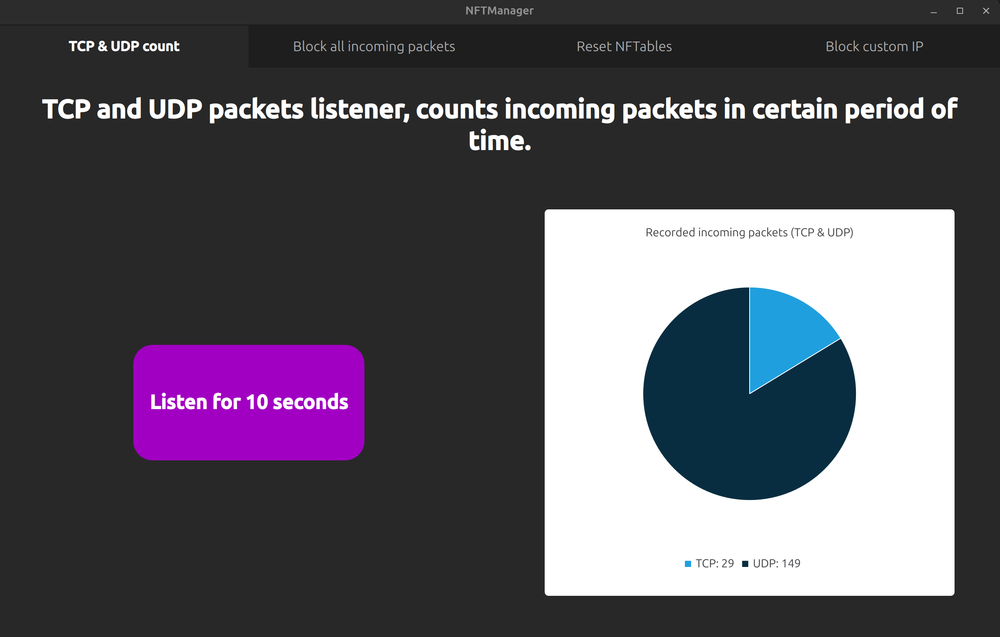
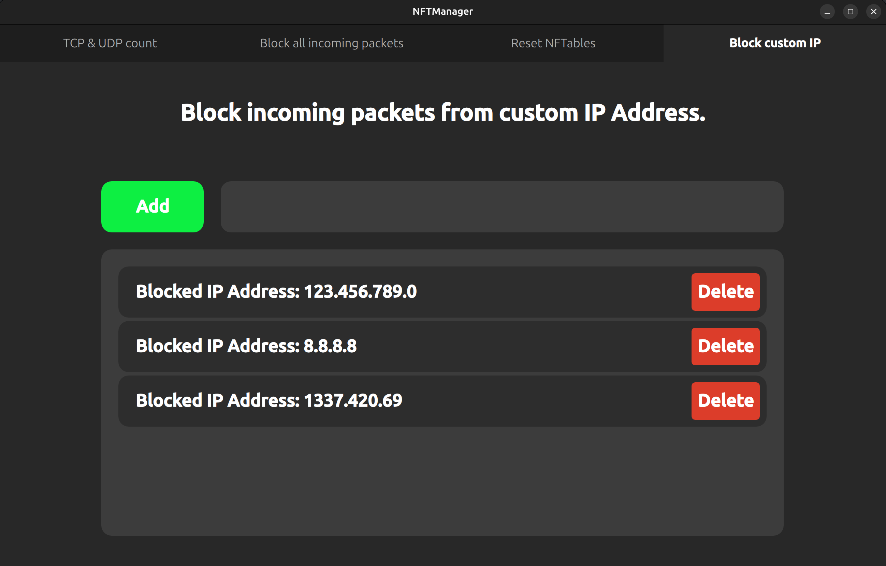

# NFT Manager

Written in C++ nad Qt (6.5.3) QML using Ubuntu's NFTables as a network filer.
NFT Manager is a very simple and basic tool, project made for learning and as a mini challange. Nothing crazy, basic functions, don't be scared when you get disconnected from any other services while using it, it block incoming packets.

# Build and run

I use CMake, for build and run I prefer to use QtCreator, if you want to make it from CLI, apply same rules as in my previous project [FilesExplorer](https://github.com/Cashtann/FileExplorer/tree/master).

# Features

### TCP and UDP counter.

Counts all incoming TCP and UDP packets (in period of 10 seconds).

### Block all incoming packets.

Block all incoming packets, still applies after reboot (be carefull, may disconnect you from other services).

### Reset NFTables.

If anything goes wrong, you can reset NFTables to default configuration.

### Block cutom IP Address.

Block all incoming packets from specified custom IP Address (you need to provide a valid one, it is not supporting IP Address validation).

